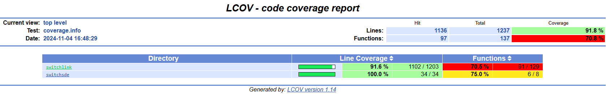
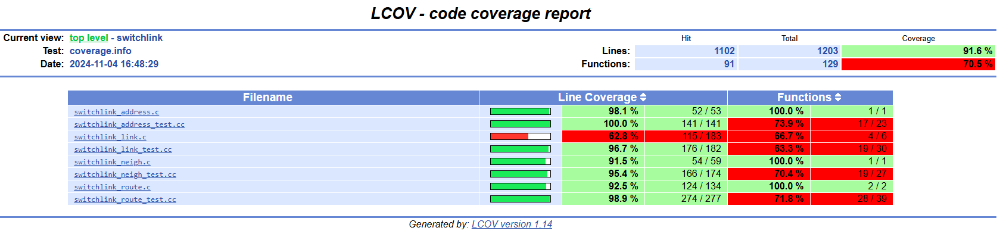
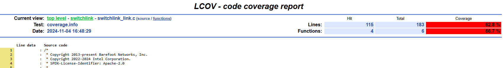
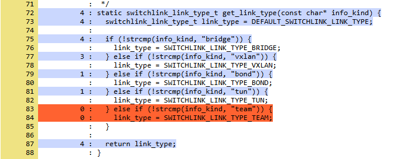

.. Copyright 2024 Intel Corporation
   SPDX-License-Identifier: Apache 2.0

==========================
Running Krnlmon Unit Tests
==========================

.. contents::
   :depth: 3

Building the Unit Tests
=======================

This guide explains how to build and run the krnlmon unit tests, and
how generate a code coverage report for them.

.. note::

   To keep things simple, the examples in this guide assume that you are
   using presets to configure cmake. You may substitute any of the other
   methods, if you wish.

Full build
----------

The krnlmon unit tests are included in a full build. There is no need to
build anything else.

Targeted build
--------------

It is not necessary to do a full build. You can limit the build to the
unit tests and their dependencies.

The first step is to configure the build.

.. code-block:: bash

   cmake --preset es2k

Then build the unit tests, specifying the ``krnlmon-unit-tests`` target.

.. code-block:: bash

   cmake --build build -j4 --target krnlmon-unit-tests

Running the Unit Tests
======================

To run the unit tests, change to the **build** directory and issue the
**ctest** command

.. code-block:: bash

   (cd build; ctest -L krnlmon --output-on-failure)

The options are:

``-L krnlmon``
  Specifies that only the krnlmon unit tests should be run.

``--output-on-failure``
  Instructs ctest to write the output of failing tests to the console.
  Normally it goes only to the test log.

Sample output:

.. code-block:: text

   Test project /home/elrond/palantir/build
       Start 1: switchlink_link_test
   1/5 Test #1: switchlink_link_test .............   Passed    0.01 sec
       Start 2: switchlink_address_test
   2/5 Test #2: switchlink_address_test ..........   Passed    0.00 sec
       Start 3: switchlink_neighbor_test
   3/5 Test #3: switchlink_neighbor_test .........   Passed    0.00 sec
       Start 4: switchlink_route_test
   4/5 Test #4: switchlink_route_test ............   Passed    0.00 sec
       Start 5: switchsde_es2k_test
   5/5 Test #5: switchsde_es2k_test ..............   Passed    0.00 sec

   100% tests passed, 0 tests failed out of 5

   Label Time Summary:
   krnlmon    =   0.02 sec*proc (5 tests)

   Total Test time (real) =   0.03 sec

Details of the run are stored in **LastTest.log** in the
**build/Testing/Temporary** folder.

Measuring Code Coverage
=======================

Build with coverage enabled
---------------------------

To measure unit test code coverage, you must enable the TEST_COVERAGE
option when you configure the build.

.. code-block:: bash

   cmake --preset es2k -DTEST_COVERAGE=ON
   cmake --build build -j4 --target krnlmon-unit-tests

Run tests and generate report
-----------------------------

The ``scripts`` directory contains a set of bash scripts to run the tests,
analyze the coverage measurements, and generate an HTML report for each
(target, test label) combination:

- scripts/es2k/report-ovsp4rt-coverage.sh
- scripts/es2k/report-krnlmon-coverage.sh
- scripts/dpdk/report-ovsp4rt-coverage.sh
- scripts/dpdk/report-krnlmon-coverage.sh

To generate the report:

.. code-block:: bash

   ./scripts/es2k/report-krnlmon-coverage.sh

Sample output:

.. code-block:: text

   (test summary omitted)

   Performing coverage
      Processing coverage (each . represents one file):
       .........
      Accumulating results (each . represents one file):
       .........
        Covered LOC:         1136
        Not covered LOC:     101
        Total LOC:           1237
        Percentage Coverage: 91.84%
   Capturing coverage data from build/krnlmon/krnlmon/
   Found gcov version: 9.4.0
   Using intermediate gcov format
   Scanning build/krnlmon/krnlmon/ for .gcda files ...
   Found 9 data files in build/krnlmon/krnlmon/

   (progress messages omitted)

   Overall coverage rate:
     lines......: 91.8% (1136 of 1237 lines)
     functions..: 70.8% (97 of 137 functions)
   Coverage report is in build/Coverage/krnlmon/es2k.

View the coverage report
------------------------

Use a browser to open **build/Coverage/krnlmon/es2k/index.html**.

|image1|

To see the summary report for the **switchlink** directory,
click on its link.

|image2|

To see the report for **switchlink_link.c**, click on its link.

|image3|

Scroll down the page to see which parts of the file are covered by
the unit test (in blue), and which parts are not covered (in orange)

|image4|

