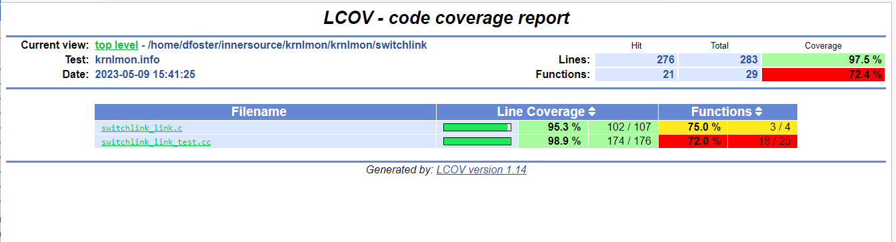
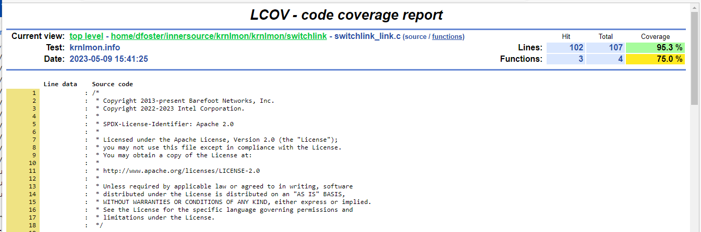
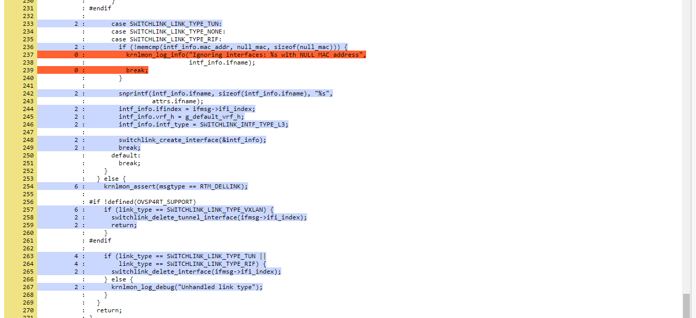

==========================
Running Krnlmon Unit Tests
==========================

Build P4 control plane
----------------------

To run the Kernel Monitor unit tests, you must first build P4 Control
Plane for DPDK or ES2K:

.. code-block:: bash

   ./make-all.sh --target=es2k

.. _run-unit-tests-1:

Run unit tests
--------------

To run the unit tests, change to the **build** directory and issue the
**ctest** command:

.. code-block:: bash

   (cd build; ctest)

When specified without any arguments, the **ctest** command runs all
the unit tests.

For example:

.. code-block:: bash

   milady@dewinter:~/recipe$ (cd build; ctest)
   Test project /home/milady/recipe/build
   Start 1: switchlink_link_test
   1/1 Test #1: switchlink_link_test ............. Passed 0.00 sec

   100% tests passed, 0 tests failed out of 1
   Total Test time (real) = 0.01 sec

The build summary will be displayed on the console.

Details of the run are stored in a log file:

.. code-block:: bash

   milady@dewinter:~/recipe$ more build/Testing/Temporary/LastTest.log
   Start testing: Apr 25 16:30 PDT
   ----------------------------------------------------------
   1/1 Testing: switchlink_link_test
   1/1 Test: switchlink_link_test
   Command: "/home/milady/recipe/build/krnlmon/krnlmon/switchlink/switchlink_link_test"
   Directory: /home/milady/recipe/build/krnlmon/krnlmon/switchlink
   "switchlink_link_test" start time: Apr 25 16:30 PDT
   Output:
   ----------------------------------------------------------
   Running main() from /home/milady/new.recipe/setup/gtest/googletest/src/gtest_main.cc
   [==========] Running 5 tests from 1 test suite.
   [----------] Global test environment set-up.
   [----------] 5 tests from SwitchlinkTest
   [ RUN      ] SwitchlinkTest.can_add_generic_link
   [ OK       ] SwitchlinkTest.can_add_generic_link (0 ms)
   [ RUN      ] SwitchlinkTest.can_add_vxlan_link
   [ OK       ] SwitchlinkTest.can_add_vxlan_link (0 ms)
   [ RUN      ] SwitchlinkTest.cannot_delete_generic_link
   [ OK       ] SwitchlinkTest.cannot_delete_generic_link (0 ms)
   [ RUN      ] SwitchlinkTest.can_delete_vxlan_link
   [ OK       ] SwitchlinkTest.can_delete_vxlan_link (0 ms)
   [ RUN      ] SwitchlinkTest.can_delete_tunnel_link
   [ OK       ] SwitchlinkTest.can_delete_tunnel_link (0 ms)
   [----------] 5 tests from SwitchlinkTest (0 ms total)

   [----------] Global test environment tear-down
   [==========] 5 tests from 1 test suite ran. (0 ms total)
   [ PASSED   ] 5 tests.
   <end of output>
   Test time = 0.01 sec
   ----------------------------------------------------------
   Test Passed.
   "switchlink_link_test" end time: Apr 25 16:30 PDT
   "switchlink_link_test" time elapsed: 00:00:00
   ----------------------------------------------------------

   End testing: Apr 25 16:30 PDT

.. _measure-code-coverage-2:

Measure code coverage
---------------------

.. _enable-measurement-1:

Enable measurement
~~~~~~~~~~~~~~~~~~

To measure unit test code coverage, you must enable the feature when you
build the P4 Control Plane.

You can do this via the make-all script:

.. code-block:: bash

   ./make-all.sh --target=es2k --coverage

Or as a CMake command-line parameter:

   -DTEST_COVERAGE=ON

.. _run-and-measure-tests-2:

Run and measure tests
~~~~~~~~~~~~~~~~~~~~~

Coverage data is collected when the unit tests are run.

You can obtain the results by running CTest on a specific target:

   (cd build; ctest -T coverage)

You can also run the tests and request the coverage report in a single
command:

   (cd build; ctest -T test -T coverage)

The results are displayed on the console:

.. code-block:: bash

   milady@dewinter:~/recipe$ (cd build; ctest -T test -T coverage)
   Site: dewinter Build name: Linux-c++
   Create new tag: 20230509-2238 - Experimental
   Test project /home/milady/recipe/build
   Start 1: switchlink_link_test
   1/1 Test #1: switchlink_link_test ............. Passed 0.00 sec

   100% tests passed, 0 tests failed out of 1

   Total Test time (real) = 0.01 sec

   Performing coverage
      Processing coverage (each . represents one file):
       ..
      Accumulating results (each . represents one file):
       ..
           Covered LOC: 276
           Not covered LOC: 7
           Total LOC: 283
           Percentage Coverage: 97.53%

.. _generate-coverage-report-2:

Generate coverage report
~~~~~~~~~~~~~~~~~~~~~~~~

To generate detailed coverage report, you must first consolidate the
measurement data:

.. code-block:: bash

   milady@dewinter:~/recipe$ lcov --capture --directory build/krnlmon/krnlmon/switchlink/CMakeFiles/switchlink_link_test.dir/ --output-file krnlmon.info
   Capturing coverage data from build/krnlmon/krnlmon/switchlink/CMakeFiles/switchlink_link_test.dir/
   Found gcov version: 9.4.0
   Using intermediate gcov format
   Scanning build/krnlmon/krnlmon/switchlink/CMakeFiles/switchlink_link_test.dir/ for .gcda files ...
   Found 2 data files in build/krnlmon/krnlmon/switchlink/CMakeFiles/switchlink_link_test.dir/
   Processing switchlink_link_test.dir/switchlink_link.c.gcda
   Processing switchlink_link_test.dir/switchlink_link_test.cc.gcda
   Finished .info-file creation

Now generate the HTML report:

.. code-block:: bash

   milady@dewinter:~/recipe$ genhtml krnlmon.info --output-directory coverage
   Reading data file krnlmon.info
   Found 24 entries.
   Found common filename prefix "/usr/include/c++"
   Writing .css and .png files.
   Generating output.
   Processing file /home/milady/recipe/krnlmon/krnlmon/switchlink/switchlink_link_test.cc
   Processing file /home/milady/recipe/krnlmon/krnlmon/switchlink/switchlink_link.c
   Processing file /opt/deps/include/gtest/gtest-message.h
   Processing file /opt/deps/include/gtest/gtest.h
   Processing file /opt/deps/include/gtest/gtest-printers.h
   Processing file /opt/deps/include/gtest/internal/gtest-internal.h
   Processing file /opt/deps/include/gtest/internal/gtest-port.h
   Processing file 9/sstream
   Processing file 9/tuple
   Processing file 9/ostream
   Processing file 9/bits/ptr_traits.h
   Processing file 9/bits/char_traits.h
   Processing file 9/bits/allocator.h
   Processing file 9/bits/move.h
   Processing file 9/bits/unique_ptr.h
   Processing file 9/bits/stl_iterator_base_funcs.h
   Processing file 9/bits/alloc_traits.h
   Processing file 9/bits/basic_string.h
   Processing file 9/bits/basic_string.tcc
   Processing file 9/ext/new_allocator.h
   Processing file 9/ext/type_traits.h
   Processing file /usr/include/x86_64-linux-gnu/bits/stdio2.h
   Processing file /usr/include/x86_64-linux-gnu/bits/string_fortified.h
   Processing file /usr/include/x86_64-linux-gnu/bits/byteswap.h
   Writing directory view page.
   Overall coverage rate:
     lines......: 69.8% (351 of 503 lines)
     functions..: 53.2% (42 of 79 functions)

.. _view-report-3:

View report
~~~~~~~~~~~

To view the coverage report, use a browser to open
**coverage/index.html**.

|image5|

To see the summary report for the **krnlmon/switchlink** directory,
click on its link:

|image6|

To see the detailed report for **switchlink_link.c**, click on its
link:

|image7|

Scroll down the file page to see which parts of the file are covered by
the unit test (in blue), and which parts are not covered (in orange)

|image8|

Minimal Builds
--------------

The CMake build system provides targets that allow unit tests to be
built and run without needing to build all of P4 Control Plane.

krnlmon-test
~~~~~~~~~~~~

To perform a minimal build and run the Kernel Monitor unit tests for
DPDK:

.. code-block:: bash

   peabody@wabac:~/recipe$ cmake -B build -DTDI_TARGET=dpdk -DWITH_OVSP4RT=off
   -- The C compiler identification is GNU 9.4.0
   -- The CXX compiler identification is GNU 9.4.0
     .
     .
   -- Configuring done
   -- Generating done
   -- Build files have been written to: /home/peabody/recipe/build

   peabody@wabac:~/recipe$ cmake --build build -j4 --target krnlmon-test
   Scanning dependencies of target switchlink_link_test
   Scanning dependencies of target switchlink_address_test
   Scanning dependencies of target switchlink_neighbor_test
   [ 16%] Building C object krnlmon/krnlmon/switchlink/CMakeFiles/switchlink_link_test.dir/switchlink_globals.c.o
   [ 16%] Building CXX object krnlmon/krnlmon/switchlink/CMakeFiles/switchlink_address_test.dir/switchlink_address_test.cc.o
   [ 33%] Building CXX object krnlmon/krnlmon/switchlink/CMakeFiles/switchlink_link_test.dir/switchlink_link_test.cc.o
   [ 50%] Building CXX object krnlmon/krnlmon/switchlink/CMakeFiles/switchlink_neighbor_test.dir/switchlink_neigh_test.cc.o
   [ 50%] Building C object krnlmon/krnlmon/switchlink/CMakeFiles/switchlink_neighbor_test.dir/switchlink_globals.c.o
   [ 66%] Building C object krnlmon/krnlmon/switchlink/CMakeFiles/switchlink_link_test.dir/switchlink_link.c.o
   [ 83%] Building C object krnlmon/krnlmon/switchlink/CMakeFiles/switchlink_neighbor_test.dir/switchlink_neigh.c.o
   [ 83%] Building C object krnlmon/krnlmon/switchlink/CMakeFiles/switchlink_address_test.dir/switchlink_address.c.o
   [100%] Building C object krnlmon/krnlmon/switchlink/CMakeFiles/switchlink_address_test.dir/switchlink_globals.c.o
   [100%] Linking CXX executable switchlink_address_test
   [100%] Linking CXX executable switchlink_link_test
   [100%] Built target switchlink_address_test
   [100%] Linking CXX executable switchlink_neighbor_test
   [100%] Built target switchlink_link_test
   [100%] Built target switchlink_neighbor_test
   Scanning dependencies of target krnlmon-test
   Test project /home/milady/recipe/build
       Start 1: switchlink_link_test
   1/3 Test #1: switchlink_link_test ............. Passed 0.01 sec
       Start 2: switchlink_address_test
   2/3 Test #2: switchlink_address_test .......... Passed 0.00 sec
       Start 3: switchlink_neighbor_test
   3/3 Test #3: switchlink_neighbor_test ......... Passed 0.01 sec

   100% tests passed, 0 tests failed out of 3

   Total Test time (real) = 0.02 sec
   [100%] Built target krnlmon-test

krnlmon-coverage
~~~~~~~~~~~~~~~~

To perform a minimal build, run the unit tests, and measure coverage for
ES2K:

.. code-block:: bash

   peabody@wabac:~/recipe$ cmake -B build -DTDI_TARGET=es2k -DWITH_OVSP4RT=off -DTEST_COVERAGE=on
   -- The C compiler identification is GNU 9.4.0
   -- The CXX compiler identification is GNU 9.4.0
     .
     .
   Building ES2K_TARGET
   -- WITH_KRNLMON="ON"
   -- WITH_OVSP4RT="off"
     .
     .
   -- Configuring done
   -- Generating done
   -- Build files have been written to: /home/peabody/recipe/build

   peabody@wabac:~/recipe$ cmake --build build -j4 --target krnlmon-test krnlmon-coverage
   Scanning dependencies of target switchlink_link_test
   Scanning dependencies of target switchlink_neighbor_test
   Scanning dependencies of target switchlink_address_test
     .
     .
   Test project /home/peabody/recipe/build
       Start 1: switchlink_link_test
   1/3 Test #1: switchlink_link_test ............. Passed 0.00 sec
       Start 2: switchlink_address_test
   2/3 Test #2: switchlink_address_test .......... Passed 0.00 sec
       Start 3: switchlink_neighbor_test
   3/3 Test #3: switchlink_neighbor_test ......... Passed 0.01 sec

   100% tests passed, 0 tests failed out of 3

   Total Test time (real) = 0.01 sec

   Performing coverage
      Processing coverage (each . represents one file):
       ......
      Accumulating results (each . represents one file):
       ......
            Covered LOC: 709
            Not covered LOC: 9
            Total LOC: 718
            Percentage Coverage: 98.75%
   [100%] Built target krnlmon-test
   Scanning dependencies of target krnlmon-coverage
   Capturing coverage data from /home/peabody/recipe/build
   Found gcov version: 9.4.0
   Using intermediate gcov format
   Scanning /home/peabody/recipe/build for .gcda files ...
   Found 6 data files in /home/peabody/recipe/build
     .
     .
   Writing directory view page.
   Overall coverage rate:
     lines......: 81.1% (872 of 1075 lines)
     functions..: 65.0% (104 of 160 functions)
   Built target krnlmon-coverage

The coverage report is generated in the **build/Testing/coverage** directory.

.. |image5| image:: images/krnlmon-coverage-report.png

