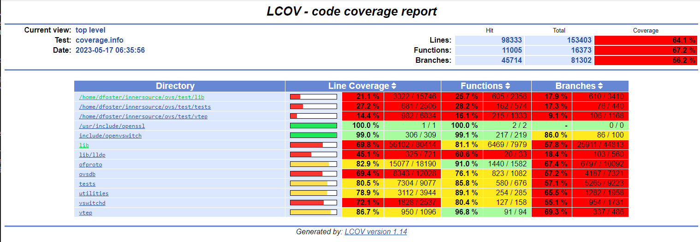

.. Copyright 2024 Intel Corporation
   SPDX-License-Identifier: Apache 2.0

======================
Running OVS Unit Tests
======================

OVS comes with its own unit test suite. The instructions for running it
may be found in the OVS
`Testing <https://github.com/ipdk-io/ovs/blob/ipdk-latest/Documentation/topics/testing.rst>`__
document.

Bootstrap OVS build
-------------------

The first step is to initialize the ovs build system by running the
bootstrap script. You can skip this step if you've already run it (e.g.,
by building OVS).

.. code-block:: bash

   pushd ovs/ovs
   ./boot.sh
   popd

The script copies a number of files to the ``ovs/ovs`` directory and
generates the ``configure`` script.

Initialize test directory
-------------------------

The next step is to build OVS. We're going to do an out-of-source build
so as not to clutter the OVS directory or interfere with our regular
build.

.. code-block:: bash

   pushd ovs
   mkdir test && cd test
   ../ovs/configure

Note that we do not specify any configuration options.

This step generates the files necessary to do the build in the ovs/test
directory.

Build OVS in test directory
---------------------------

The next step is to build OVS in the ovs/test directory.

.. code-block:: bash

   make -j6 V=0

You can change the number of build threads (``-jN``) to something
appropriate for your system.

The V=0 parameter gives you a less verbose build log.

Run unit tests
--------------

Now you can run the unit test suite.

.. code-block:: bash

   make check TESTSUITEFLAGS=-j8

The TESTSUITEFLAGS parameter accepts a number of options, which are
described in the
`testing.rst <https://github.com/ipdk-io/ovs/blob/ovs-with-p4/Documentation/topics/testing.rst>`__
document.

The -j8 parameter value specifies the number of test threads to use. You
will almost undoubtedly want to use this parameter; there are ~2500 test
cases in the suite.

Review test results
-------------------

Each test case generates a single line of output as it is executed,
consisting of the test number, test name, and the results of the test.

A summary is displayed after the last test case has been run.

.. code-block:: bash

   ## ------------- ##
   ## Test results. ##
   ## ------------- ##

   ERROR: 2504 tests were run,
   8 failed unexpectedly.
   3 tests were skipped.
   ## -------------------------- ##
   ## testsuite.log was created. ##
   ## -------------------------- ##

   Please send \`tests/testsuite.log' and all information you think might
   help:

      To: <bugs@openvswitch.org>
      Subject: [openvswitch 3.0.90] testsuite: 771 773 778 780 781 1279 1949 2232 failed

   You may investigate any problem if you feel able to do so, in which
   case the test suite provides a good starting point. Its output may
   be found below \`tests/testsuite.dir'.

Details of each failed test are saved in the ``ovs/tests/testsuite.dir``
directory, for use in debugging.

.. code-block:: bash

   ~/recipe/ovs/test$ ls tests/testsuite.dir
   0771 0773 0778 0780 0781 1279 1949 2232 at-job-fifo
   ~/recipe/ovs/test$ ls tests/testsuite.dir/0771
   cleanup conf.db flows.txt ovs-vswitchd.log ovsdb-server.log run stderr stdout testsuite.log

Measure code coverage
---------------------

Enable measurement
~~~~~~~~~~~~~~~~~~

To enable unit test code coverage, you will need to build OVS with the
--enable-coverage option.

.. code-block:: bash

   cd recipe/ovs
   rm -fr test
   mkdir test && cd test
   ../ovs/configure --enable-coverage
   make -j8 V=0

Run and measure tests
~~~~~~~~~~~~~~~~~~~~~

Then run the test suite using the check-lcov Makefile target.

.. code-block:: text

   make check-lcov TESTSUITEFLAGS=-j8

   (progress messages omitted)

   ## ------------- ##
   ## Test results. ##
   ## ------------- ##

   ERROR: 2504 tests were run,
   7 failed unexpectedly.
   3 tests were skipped.
   ## -------------------------- ##
   ## testsuite.log was created. ##
   ## -------------------------- ##

   Please send \`tests/testsuite.log' and all information you think might
   help:

   To: <bugs@openvswitch.org>
   Subject: [openvswitch 3.0.90] testsuite: 771 773 778 780 781 961 1279 failed

   You may investigate any problem if you feel able to do so, in which
   case the test suite provides a good starting point. Its output may
   be found below \`tests/testsuite.dir'.

   make: [Makefile:7035: check-lcov] Error 1 (ignored)
   /usr/bin/mkdir -p tests/lcov
   lcov -b /home/porthos/recipe/ovs/test -d /home/porthos/recipe/ovs/test -q -c --rc lcov_branch_coverage=1 -o tests/lcov/coverage.info
   genhtml -q --branch-coverage --num-spaces 4 -o tests/lcov tests/lcov/coverage.info
   genhtml: WARNING: negative counts found in tracefile tests/lcov/coverage.info
   coverage report generated at tests/lcov/index.html

View report
~~~~~~~~~~~

To view the coverage report, open **ovs/tests/lcov/index.html** in a
browser.

|image0|

