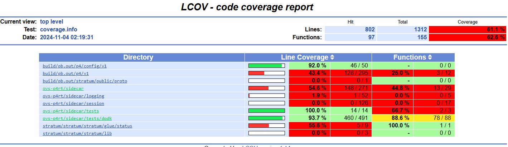
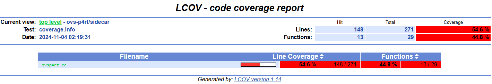
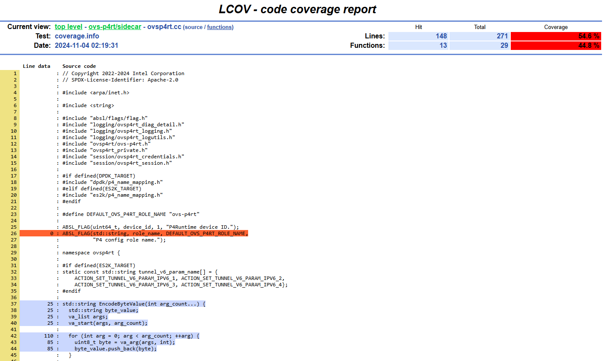

.. Copyright 2024 Intel Corporation
   SPDX-License-Identifier: Apache 2.0

==========================
Running OVSP4RT Unit Tests
==========================

.. contents::
   :depth: 3

Building the Unit Tests
=======================

This guide explains how to build and run the ovsp4rt unit tests, and
how generate a code coverage report for them.

.. note::

   To keep things simple, the examples in this guide assume that you are
   using presets to configure cmake. You may substitute any of the other
   methods, if you wish.

Full build
----------

The ovsp4rt unit tests are included when you do a full build.

Targeted build
--------------

If you're actively working on ovsp4rt or its tests, you may not want
to do full builds all the time. This section shows how to build just
the ovsp4rt tests and their dependencies.

The first step is to configure the build.

.. code-block:: bash

   cmake --preset dpdk

Then build the unit tests.

.. code-block:: bash

   cmake --build build -j5 --target ovsp4rt-unit-tests

The ``ovsp4rt-unit-tests`` target builds the ovsp4rt unit tests plus
their dependencies.

Running the Unit Tests
======================

Tests are executed via the ``ctest`` command. This must be done in the
build directory. One way to do this is with a nested subshell.

.. code-block:: bash

   (cd build; ctest -L ovsp4rt --output-on-failure)

The options used here are:

``-L ovsp4rt``
  By default, ctest runs all the tests in the project, including
  the krnlmon tests. The ``-L`` option specifies a *test label*
  that limits the selection to the ovsp4rt tests.

``--output-on-failure``
  Normally, ctest displays a summary of the tests that were run, with an
  indication of which passed and which failed. If a test fails, you will
  need to check the logfile to determine what the failure was.

  This option instructs ctest to write the output of failing tests
  to the console.

Unit test logs are written to the **build/Testing/Temporary** folder.
The most recent log is in **LastTest.log**.

Measuring Test Coverage
=======================

Build with coverage enabled
---------------------------

To measure unit test code coverage, you must enable the TEST_COVERAGE
option when you configure the build.

.. code-block:: bash

   cmake --preset dpdk -DTEST_COVERAGE=ON
   cmake --build build -j5 --target ovsp4rt-unit-tests

Measure coverage and generate report
------------------------------------

The ``scripts`` directory contains a set of bash scripts to run the tests,
analyze the coverage measurements, and generate an HTML report for each
(target, test label) combination:

- scripts/es2k/report-ovsp4rt-coverage.sh
- scripts/es2k/report-krnlmon-coverage.sh
- scripts/dpdk/report-ovsp4rt-coverage.sh
- scripts/dpdk/report-krnlmon-coverage.sh

To generate the report:

.. code-block:: bash

   ./scripts/dpdk/report-ovsp4rt-coverage.sh

Sample output:

.. code-block:: text

      Site: baggins
      Build name: Linux-c++
   Create new tag: 20241104-1018 - Experimental
   Test project /home/bilbo/work/latest/build
       Start  6: encode_host_port_value_test
   1/6 Test  #6: encode_host_port_value_test ......   Passed    0.02 sec
       Start  7: dpdk_fdb_rx_vlan_test
   2/6 Test  #7: dpdk_fdb_rx_vlan_test ............   Passed    0.03 sec
       Start  8: dpdk_fdb_tx_vlan_test
   3/6 Test  #8: dpdk_fdb_tx_vlan_test ............   Passed    0.03 sec
       Start  9: dpdk_fdb_tx_vxlan_test
   4/6 Test  #9: dpdk_fdb_tx_vxlan_test ...........   Passed    0.03 sec
       Start 10: dpdk_tunnel_term_test
   5/6 Test #10: dpdk_tunnel_term_test ............   Passed    0.03 sec
       Start 11: dpdk_vxlan_encap_test
   6/6 Test #11: dpdk_vxlan_encap_test ............   Passed    0.03 sec

   100% tests passed, 0 tests failed out of 6
       .
       .
   Overall coverage rate:
     lines......: 61.1% (802 of 1312 lines)
     functions..: 62.6% (97 of 155 functions)
   Coverage report is in build/Coverage/ovsp4rt/dpdk.

View the coverage report
------------------------

Use a browser to open **build/Coverage/ovsp4rt/dpdk/index.html**.

|image1|

To see the summary report for the **ovs-p4rt/sidecar** folder, click on
its link.

|image2|

To see the detailed report for **ovsp4rt.cc**, click on its link.

|image3|

Scroll down the file page to see which parts of the file are covered by
the unit test (in blue), and which parts are not covered (in orange).

