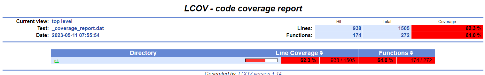
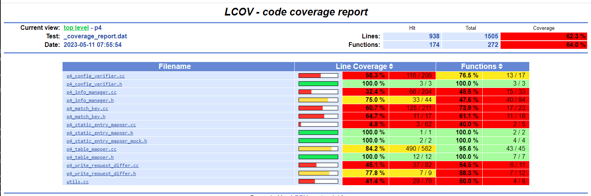
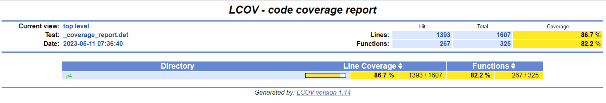
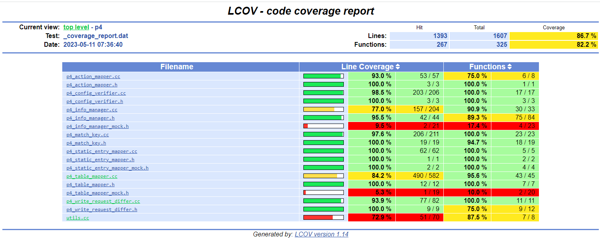

.. Copyright 2024 Intel Corporation
   SPDX-License-Identifier: Apache 2.0

==========================
Running Stratum Unit Tests
==========================

.. contents::
   :depth: 3

Prerequisites
-------------

Install Bazel
~~~~~~~~~~~~~

The Stratum unit tests run under control of the Bazel build system. You
will need to install the correct version of Bazel in order to run them.

.. code-block:: bash

   sudo apt install bazel-4.2.3

For maximum performance, you will want to do unit testing on a system
with sufficient resources (cores, memory, disk space) to support
multiple threads and a large Bazel cache, or a build farm with a large
remote cache.

Install SDE(s)
~~~~~~~~~~~~~~

Build and install the SDEs for the targets you wish to test. You will
need to install all three SDEs (Tofino, DPDK, ES2K) in order to run the
full suite of tests.

You will need to make the following modification to the ES2K SDE after
you install it:

.. code-block:: bash

   echo "ES2K" > path-to-es2k-sde/share/TARGET

The Bazel build uses this file to verify that the SDE pointed to by the
environment variable is for ES2K.

Define environment variable(s)
~~~~~~~~~~~~~~~~~~~~~~~~~~~~~~

You will need to define an environment variable that provides the path
to the install directory for the SDE.

========== =====================================================
**Target** **Environment Variable**
========== =====================================================
Tofino     SDE_INSTALL=path-to-tofino-sde (*or*)
           SDE_INSTALL_TAR=path-to-tarball-containing-tofino-sde
DPDK       DPDK_INSTALL=path-to-dpdk-sde (*or*)
           SDE_INSTALL=path-to-dpdk-sde
ES2K       ES2K_INSTALL=path-to-es2k-sde (*or*)
           SDE_INSTALL=path-to-es2k-sde
========== =====================================================

Getting source code
-------------------

P4 Control Plane (networking-recipe)
~~~~~~~~~~~~~~~~~~~~~~~~~~~~~~~~~~~~

If you are working with a copy of the full P4 Control Plane, you will
need to change to the Stratum root directory.

.. code-block:: bash

   cd stratum/stratum

To confirm that you are in the right directory, check for a file named
WORKSPACE.

.. code-block:: bash

   doctor@tardis:~/stratum$ ls WORKSPACE
   WORKSPACE

Standalone Stratum
~~~~~~~~~~~~~~~~~~

You can run the unit tests on a standalone instance of the Stratum
repository.

.. code-block:: bash

   git clone https://github.com/ipdk-io/stratum-dev.git stratum
   cd stratum

Running tests
-------------

Test selection
~~~~~~~~~~~~~~

Single test
^^^^^^^^^^^

To run a single test, issue a **bazel test** command specifying the
target test you wish to run:

.. code-block:: bash

   bazel test //stratum/hal/lib/p4:p4_table_mapper_test

Bazel will build the test and its dependencies if they are out of date.
It will then run the test.

.. code-block:: text

   INFO: Analyzed target //stratum/hal/lib/p4:p4_table_mapper_test (2 packages loaded, 4105 targets configured).
   INFO: Found 1 test target...
   Target //stratum/hal/lib/p4:p4_table_mapper_test up-to-date:
     bazel-bin/stratum/hal/lib/p4/p4_table_mapper_test
   INFO: Elapsed time: 10.517s, Critical Path: 9.27s
   INFO: 5 processes: 2 internal, 3 linux-sandbox.
   INFO: Build completed successfully, 5 total actions

   //stratum/hal/lib/p4:p4_table_mapper_test                     PASSED in 0.5s

   INFO: Build completed successfully, 5 total actions

All tests in a directory
^^^^^^^^^^^^^^^^^^^^^^^^

You can run all the tests in a directory by specifying the target name **all**:

.. code-block:: bash

   bazel test //stratum/hal/lib/p4:all

Abbreviated output:

.. code-block:: text

   //stratum/hal/lib/p4:p4_table_mapper_test (cached)            PASSED in 0.5s
   //stratum/hal/lib/p4:p4_action_mapper_test                    PASSED in 0.2s
   //stratum/hal/lib/p4:p4_config_verifier_test                  PASSED in 0.4s
   //stratum/hal/lib/p4:p4_info_manager_test                     PASSED in 0.2s
   //stratum/hal/lib/p4:p4_match_key_test                        PASSED in 0.5s
   //stratum/hal/lib/p4:p4_static_entry_mapper_test              PASSED in 0.2s
   //stratum/hal/lib/p4:p4_write_request_differ_test             PASSED in 0.3s
   //stratum/hal/lib/p4:utils_test                               PASSED in 0.3s

All tests in or below a directory
^^^^^^^^^^^^^^^^^^^^^^^^^^^^^^^^^

You can select a directory and its subdirectories by specifying an ellipsis
(**...**):

.. code-block:: bash

   bazel test //stratum/glue/...

Abbreviated output:

.. code-block:: text

   //stratum/glue/gtl:cleanup_test                                PASSED in 0.0s
   //stratum/glue/gtl:map_util_test                               PASSED in 0.0s
   //stratum/glue/net_util:absl_test                              PASSED in 0.1s
   //stratum/glue/net_util:bits_test                              PASSED in 0.9s
   //stratum/glue/net_util:ipaddress_test                         PASSED in 0.1s
   //stratum/glue/status:status_test                              PASSED in 0.0s

Target-specific tests
^^^^^^^^^^^^^^^^^^^^^

If any of the tests you wish to run is in one of the following
directories, you will need to specify the target to use:

-  //stratum/hal/lib/common
-  //stratum/hal/lib/tdi
-  //stratum/hal/lib/tdi/dpdk
-  //stratum/hal/lib/tdi/es2k
-  //stratum/hal/lib/tdi/tofino

You do this by including the following on the command line. It can go
before or after the target name.

.. code-block:: text

   --define target=<target>

where <target> is one of ``dpdk``, ``es2k``, or ``tofino``.

For example:

.. code-block:: bash

   bazel test --define target=dpdk //stratum/hal/lib/tdi/dpdk:dpdk_chassis_test

All tests in a file
^^^^^^^^^^^^^^^^^^^

You can put a list of targets in a text file:

**tofino-tests.txt:**

.. code-block:: text

   //stratum/hal/lib/tdi/tofino:tofino_hal_test
   //stratum/hal/lib/tdi/tofino:tofino_switch_test

And run them using the command:

.. code-block:: bash

   xargs -a tofino-tests.txt bazel test --define target=tofino

Abbreviated output:

.. code-block:: text

   //stratum/hal/lib/tdi/tofino:tofino_hal_test (cached)          PASSED in 0.4s
   //stratum/hal/lib/tdi/tofino:tofino_switch_test (cached)       PASSED in 0.4s

ES2K Tests
^^^^^^^^^^

The following is a suggested set of unit tests for ES2K:

**es2k-tests.txt**

.. code-block:: text

   //stratum/glue/...
   //stratum/hal/lib/p4/...
   //stratum/lib/...
   //stratum/public/...
   //stratum/hal/lib/tdi:all
   //stratum/hal/lib/tdi/es2k:es2k_chassis_manager_test
   //stratum/hal/lib/tdi/es2k:es2k_hal_test
   //stratum/hal/lib/yang...

These tests should be run against the ES2K SDE:

.. code-block:: bash

   xargs -a es2k-tests.txt bazel test --define target=es2k

DPDK Tests
^^^^^^^^^^

The following is a suggested set of unit tests for DPDK:

**dpdk-tests.txt**

.. code-block:: text

   //stratum/glue/...
   //stratum/hal/lib/p4/...
   //stratum/lib/...
   //stratum/public/...
   //stratum/hal/lib/tdi:tdi_action_profile_manager_test
   //stratum/hal/lib/tdi:tdi_counter_manager_test
   //stratum/hal/lib/tdi:tdi_packetio_manager_test
   //stratum/hal/lib/tdi:tdi_pipeline_utils_test
   //stratum/hal/lib/tdi:tdi_pre_manager_test
   //stratum/hal/lib/tdi:tdi_table_manager_test
   //stratum/hal/lib/tdi:utils_test
   //stratum/hal/lib/tdi/dpdk:dpdk_chassis_manager_test
   //stratum/hal/lib/yang/...

These tests should be run against the DPDK SDE:

.. code-block:: bash

   xargs -a dpdk-tests.txt bazel test --define target=dpdk

Flaky Tests
~~~~~~~~~~~

Some of the unit tests are known to be flaky (they fail intermittently).
These tests have been flagged as flaky by specifying ``tags = ["flaky"]``
in the ``stratum_cc_test`` rule.

To run a test suite excluding flaky tests:

.. code-block:: bash

   xargs -a dpdk-tests.txt bazel test --define target=dpdk --test_tag_filters=-flaky

Test results
~~~~~~~~~~~~

Stratum unit tests use the Google Test framework, so it is possible to
generate XML or JSON output by specifying the ``--gtest_output`` parameter
on the test command line.

I have not found a way to do this through the ``bazel test`` command.

Measuring test coverage
-----------------------

Single-test coverage
~~~~~~~~~~~~~~~~~~~~

.. _measuring-coverage-1:

Measuring coverage
^^^^^^^^^^^^^^^^^^

Unit test code coverage can be measured by means of the **bazel coverage**
command:

.. code-block:: bash

   bazel coverage \
      --combined_report=lcov \
      --javabase=@bazel_tools//tools/jdk:remote_jdk11 \
      //stratum/hal/lib/p4:p4_table_mapper_test

Abbreviated output:

.. code-block:: text

   //stratum/hal/lib/p4:p4_table_mapper_test                      PASSED in 1.9s

.. _generating-report-1:

Generating the report
^^^^^^^^^^^^^^^^^^^^^

To generate an HTML coverage report:

.. code-block:: bash

   genhtml --output coverage \
      "$(bazel info output_path)/_coverage/_coverage_report.dat"

Abbreviated output:

.. code-block:: text

   Overall coverage rate:
     lines......: 62.3% (938 of 1505 lines)
     functions..: 64.0% (174 of 272 functions)

.. _viewing-report_1:

Viewing the report
^^^^^^^^^^^^^^^^^^

To view the coverage report, open **coverage/index.html** in a browser:

|image1|

Click the directory name to see the files page:

|image2|

Multiple-test coverage
~~~~~~~~~~~~~~~~~~~~~~

.. _measuring-coverage-2:

Measuring coverage
^^^^^^^^^^^^^^^^^^

To run and measure coverage for all the tests in a directory:

.. code-block:: bash

   bazel coverage \
      --combined_report=lcov \
      --javabase=@bazel_tools//tools/jdk:remote_jdk11 \
      //stratum/hal/lib/p4:all

Abbreviated output:

.. code-block:: text

   //stratum/hal/lib/p4:p4_table_mapper_test (cached)             PASSED in 1.9s
   //stratum/hal/lib/p4:p4_action_mapper_test                     PASSED in 1.9s
   //stratum/hal/lib/p4:p4_config_verifier_test                   PASSED in 2.6s
   //stratum/hal/lib/p4:p4_info_manager_test                      PASSED in 2.0s
   //stratum/hal/lib/p4:p4_match_key_test                         PASSED in 2.2s
   //stratum/hal/lib/p4:p4_static_entry_mapper_test               PASSED in 2.3s
   //stratum/hal/lib/p4:p4_write_request_differ_test              PASSED in 1.7s
   //stratum/hal/lib/p4:utils_test                                PASSED in 1.9s

.. _generating-report-2:

Generating the report
^^^^^^^^^^^^^^^^^^^^^

To generate an HTML coverage report:

.. code-block:: bash

   rm -fr coverage/
   genhtml --output coverage \
      "$(bazel info output_path)/_coverage/_coverage_report.dat"

Abbreviated output:

.. code-block:: text

   Overall coverage rate:
     lines......: 86.7% (1393 of 1607 lines)
     functions..: 82.2% (267 of 325 functions)

.. _viewing-report-2:

Viewing the report
^^^^^^^^^^^^^^^^^^

To view the coverage report, use a browser to open **coverage/index.html**:

|image3|

Click the **p4** directory to view the files page:

|image4|

